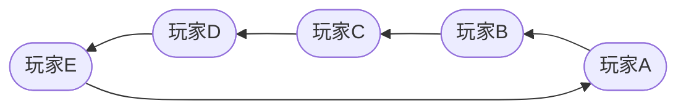

# FengSheng

## 声明

- **本项目采用`AGPLv3`协议开源，任何直接、间接接触本项目的软件也要求使用`AGPLv3`协议开源**
- **本项目仅用于学习和测试。不鼓励，不支持一切商业用途**
- **本项目的作者由所有参与的开发者共同所有。请尊重各位开发者的劳动成果**
- **在使用前，使用者应该对本项目有充分的了解。任何由于使用本项目提供的接口、文档等造成的不良影响和后果与任何开发者无关**
- 由于本项目的特殊性，可能随时停止开发或删档
- 本项目为开源项目，不接受任何的催单和索取行为

## 运行

```shell
./gradlew run
```

## 配置

**游戏配置**

第一次运行会在根目录下生成一个`application.properties`，如下：

```properties
# 服务端监听端口
listen_port=9091
# 游戏开始时摸牌数
rule.hand_card_count_begin=3
# 每回合摸牌数
rule.hand_card_count_each_turn=3
# 最大房间数
room_count=200
# 玩家总人数
player.total_count=5
# 需要的客户端最低版本号
client_version=1
# 测试时强制设置的角色，按进入房间的顺序安排
gm.debug_roles=22,26
gm.enable=false
gm.listen_port=9092
```

**log4j配置**

见`src/main/resources/log4j.properties`

## 游戏步骤

玩家按照逆时针的顺序依次进行回合



每个回合只有五个阶段，且按照顺序进行


## 关于GM命令

直接GET请求 http://127.0.0.1:9092/xxxx?a=1&b=2 即可使用。目前支持的GM命令有：

| 终结点          | 参数                      | 备注                                                                  |
|--------------|-------------------------|---------------------------------------------------------------------|
| /addcard     | player=0&card=1&count=1 | 其中player参数对应**服务器中的**玩家Id，card参数对应协议中的卡牌类型，count参数（非必填，默认1）为增加卡牌的个数 |
| /addrobot    | count=1                 | 其中count参数对应想要增加机器人的个数，不填表示加满                                        |
| /getscore    | name=aaa                | 其中name参数是想要获取分数的玩家名字                                                |
| /ranklist    | 无                       | 获取排行榜                                                               |
| /resetpwd    | name=aaa                | 其中name参数是想要重置密码的玩家名字（重置为空，玩家可以自行重新设置）                               |
| /forbidrole  | name=aaa                | 禁用角色，禁用的角色不会再出现在角色池里，其中name参数是想要禁用的中文角色名                            |
| /releaserole | name=aaa                | 启用角色，其中name参数是想要启用的中文角色名                                            |
| /setnotice   | notice=aaa              | 热更新公告，其中notice字段就是要更新成什么                                            |
| /setversion  | version=1               | 热更新客户端版本号，其中version字段就是要更新成多少                                       |
| /register    | name=aaa                | 注册，其中name是用户名                                                       |

## 开发相关

如遇IDEA提示“代码洞察功能不可用”，是因为role.proto生成的协议文件太大导致的，在帮助菜单中编辑一下IDEA的自定义属性`idea.properties`
即可：

```properties
#---------------------------------------------------------------------
# Maximum file size (kilobytes) IDE should provide code assistance for.
# The larger file is the slower its editor works and higher overall system memory requests
# if code assistance is enabled. Remove this property or set to very large number if your
# code assistance for any files available regardless their size.
#---------------------------------------------------------------------
idea.max.intellisense.filesize=2500
#---------------------------------------------------------------------
# Maximum file size (kilobytes) IDE is able to open.
#---------------------------------------------------------------------
idea.max.content.load.filesize=20000
```

将`idea.max.intellisense.filesize`的值改大。若没有这个属性，自行添加即可。